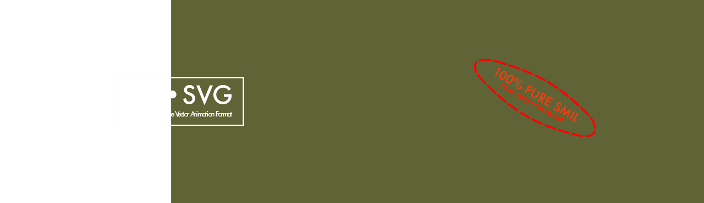
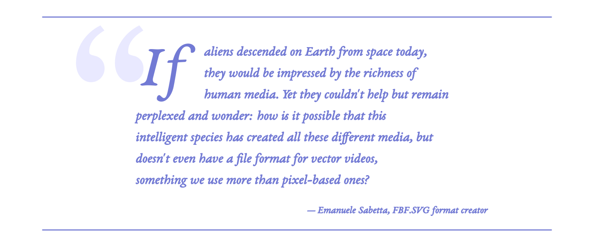
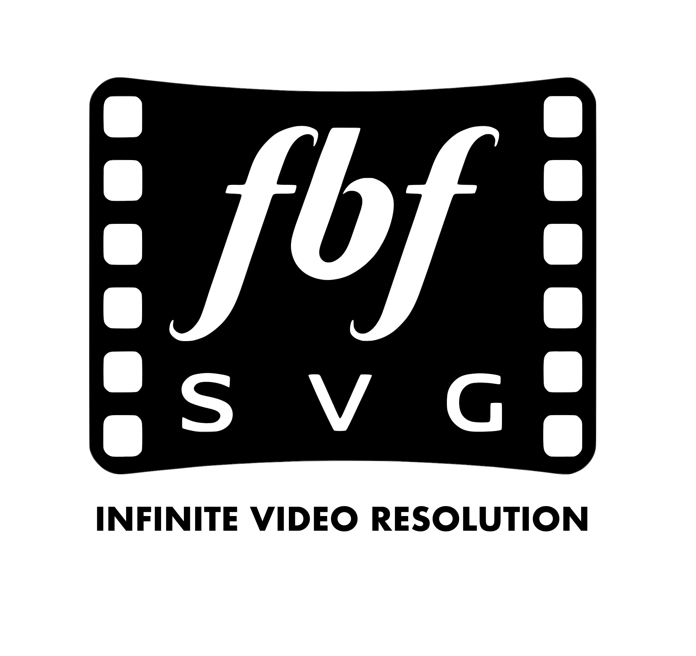
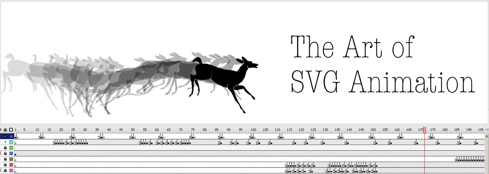

<!-- Animated Header with FBF.SVG Title -->
<p align="center">
  
</p>

<h1 align="center">svg2fbf</h1>

<p align="center">
  <strong>SVG Frame-by-Frame Animation Generator</strong>
</p>

<p align="center">
  <a href="https://opensource.org/licenses/Apache-2.0"></a>
  <a href="https://www.python.org/downloads/"></a>
  <a href="https://github.com/Emasoft/svg2fbf/releases"></a>
</p>

<p align="center">
  <a href="https://github.com/opentoonz/opentoonz"></a>
</p>

<p align="center">
  <em>FBF.SVG format is discussed here: <a href="https://github.com/opentoonz/opentoonz/issues/5346">OpenToonz Issue #5346</a> - bringing vector frame-by-frame animation to the web</em>
</p>

---

> **⚠️ ALPHA SOFTWARE**: svg2fbf is currently in **alpha development**. While functional and tested, the API, command-line interface, and FBF format specification may change between releases. Use in production with caution and expect breaking changes until the stable 1.0 release. Check the [releases page](https://github.com/Emasoft/svg2fbf/releases) for the latest version.

---

## Table of Contents

- [About FBF.SVG Format](#about-fbfsvg-format)
  - [Design Principles](#design-principles)
  - [Format Specification & Schema](#format-specification--schema)
- [FBF.SVG Official Logo](#fbfsvg-official-logo)
- [Comparison to Other Web Vector Animation Formats](#comparison-to-other-web-vector-animation-formats)
  - [🏆 FBF.SVG vs. The Competition: Web & Mobile](#-fbfsvg-vs-the-competition-web--mobile)
  - [💡 The Verdict](#-the-verdict)
  - [Understanding the Difference: Formats vs. Implementation Methods](#understanding-the-difference-formats-vs-implementation-methods)
  - [Why FBF.SVG Stands Out: A Standard Image File, Not Code](#why-fbfsvg-stands-out-a-standard-image-file-not-code)
  - [📚 Full Documentation](#-full-documentation)
- [Description](#description)
  - [Key Features](#key-features)
- [Output Examples](#output-examples)
- [Requirements](#requirements)
- [Installation](#installation)
  - [Install uv](#install-uv)
  - [Install svg2fbf](#install-svg2fbf)
  - [Alternative Installation Methods](#alternative-installation-methods)
  - [Verify Installation](#verify-installation)
  - [Upgrading](#upgrading)
  - [Uninstalling](#uninstalling)
- [SVG ViewBox Repair Utility](#svg-viewbox-repair-utility)
  - [Why ViewBox Repair?](#why-viewbox-repair)
  - [Automatic Dependency Installation](#automatic-dependency-installation)
  - [Usage](#usage)
  - [Animation Sequence Mode](#animation-sequence-mode)
  - [Example Output](#example-output)
- [Quick Start](#quick-start)
  - [Basic Usage](#basic-usage)
  - [Using FBF Generation Cards](#using-fbf-generation-cards)
  - [Animation Types](#animation-types)
  - [Generate an Animated Button](#generate-an-animated-button)
- [CLI Parameters](#cli-parameters)
  - [Core Options](#core-options)
  - [Advanced Options](#advanced-options)
  - [Metadata Options](#metadata-options)
  - [Animation Types](#animation-types-1)
- [FBF Generation Cards](#fbf-generation-cards)
  - [What Are Generation Cards?](#what-are-generation-cards)
  - [Using Generation Cards](#using-generation-cards)
  - [How svg2fbf Works](#how-svg2fbf-works)
  - [Advanced Capabilities: Streaming & Interactive Visual Communication](#advanced-capabilities-streaming--interactive-visual-communication)
  - [SVG 2.0 Mesh Gradient Support](#svg-20-mesh-gradient-support)
- [Input Frame Requirements](#input-frame-requirements)
  - [File Naming](#file-naming)
  - [SVG Format Requirements](#svg-format-requirements)
  - [Resources and Assets](#resources-and-assets)
- [Documentation](#documentation)
- [Tools & Scripts](#tools--scripts)
- [Troubleshooting](#troubleshooting)
- [Contributing](#contributing)
- [License](#license)
- [Acknowledgments](#acknowledgments)
- [Origin](#origin)

---

## About FBF.SVG Format

**FBF.SVG** (Frame-by-Frame SVG) is a proposed **candidate substandard of the SVG specification**, analogous to SVG Tiny and SVG Basic. It defines a constrained, optimized profile for declarative frame-by-frame animations that are valid SVG 1.1/2.0 documents with additional structural and conformance requirements.

<p align="center">
  
</p>

### Design Principles

The FBF.SVG format is designed around eight core principles:

1. **SVG Compatibility** - Every FBF.SVG document is a valid SVG document
2. **Declarative Animation** - Uses SMIL timing, not imperative scripting
3. **Security First** - No external resources; strict Content Security Policy compliance
4. **Optimization** - Smart deduplication and shared definitions minimize file size
5. **Validatability** - Mechanically validatable against formal schema
6. **Self-Documentation** - Comprehensive embedded metadata in RDF/XML format
7. **Streaming Architecture** - Unlimited real-time frame addition without playback interruption
8. **Interactive Visual Communication** - Bidirectional LLM-to-user visual interaction protocol

### Format Specification & Schema

**📂 [FBF.SVG Format Standard](FBF.SVG/)** — Complete format specification in dedicated folder

Core documents:
- **📋 [Specification](FBF.SVG/FBF_SVG_SPECIFICATION.md)** - Complete format specification
- **📐 [XML Schema (XSD)](FBF.SVG/fbf-svg.xsd)** - Formal schema definition for validation
- **📊 [Metadata Spec](FBF.SVG/FBF_METADATA_SPEC.md)** - RDF/XML metadata requirements
- **📝 [Format Guide](FBF.SVG/FBF_FORMAT.md)** - Technical implementation details
- **📄 [Proposal](FBF.SVG/FBF_SVG_PROPOSAL.md)** - Original proposal with use cases

The specification defines two conformance levels:
- **FBF.SVG Basic** - Core structural and animation requirements
- **FBF.SVG Full** - Adds comprehensive RDF/XML metadata

The **svg2fbf** tool generates FBF.SVG Full conformant documents.

---

## FBF.SVG Official Logo:

<div align="center">
  <a href="https://github.com/Emasoft/svg2fbf">
    <picture>
      <source media="(prefers-color-scheme: light)" srcset=".github/images/fbf_svg_logo_plain_white.svg">
      <source media="(prefers-color-scheme: dark)" srcset=".github/images/fbf_svg_logo_plain_black.svg">
      
    </picture>
  </a>
</div>


---

## Comparison to Other Web Vector Animation Formats

**🎯 FBF.SVG is a Perfectly Standard SVG Image File**

FBF.SVG files are **100% standard SVG images** — nothing more, nothing less:
- ✅ **NO JavaScript code** inside the file
- ✅ **NO CSS code** inside the file
- ✅ **NO external dependencies**
- ✅ Just pure, standard SVG markup (XML)

**Compatible with millions of software tools:**
- Opens in **any web browser** (Chrome, Firefox, Safari, Edge)
- Opens in **any SVG editor** (Inkscape, Illustrator, Affinity Designer, CorelDRAW)
- Opens in **any image viewer** that supports SVG
- Opens in **video editors** (Premiere, Final Cut, DaVinci Resolve, Kdenlive)
- Opens in **design tools** (Figma, Sketch, Canva)
- Works in **mobile apps** (iOS, Android native SVG support)

**The ZERO CODE Advantage:** FBF.SVG is the **only** web vector animation format that contains **ZERO CODE**:
- ✅ **0 CODE to create** — Use visual tools (Inkscape, Krita, OpenToonz, Blender)
- ✅ **0 CODE in the file** — Pure SVG image, no JavaScript, no CSS
- ✅ **0 CODE to edit** — Edit output in any SVG graphic application
- ✅ **0 CODE to play** — Native browser support, open and it animates

This comparison highlights what makes FBF.SVG unique in the web animation ecosystem. Questions are framed to show capabilities that matter for professional animation workflows.

**📊 [View Full Detailed Comparison Tables](FBF.SVG/COMPARISON_TABLE.md)** — Complete comparison with **separate detailed tables for web formats and mobile platforms**, plus all formats, tools, pricing, and 78 documented references

### 🏆 FBF.SVG vs. The Competition: Web & Mobile

**One format. Zero code. Works everywhere.** This comparison evaluates the most popular alternatives across web and mobile to show why FBF.SVG is superior.

| **What Makes a Great Animation Format?** | **🎯 FBF.SVG** | **Lottie** (Bodymovin) | **OCA** (Open Cel) | **Rive** | **Spine** | **Alembic** (.abc) |
|---|:---:|:---:|:---:|:---:|:---:|:---:|
| **Output is a standard SVG image file?** | ✅ **YES!** | ❌ NO, outputs JSON | ❌ NO, outputs JSON+PNG | ❌ NO, outputs .riv binary | ❌ NO, outputs binary+atlas | ❌ NO, outputs .abc scene data (interchange format) |
| **Compatible with millions of SVG tools?** | ✅ **YES!** (Inkscape, Illustrator, etc.) | ❌ NO, proprietary format | ❌ NO, limited to animation tools | ❌ NO, proprietary format | ❌ NO, proprietary format | ❌ NO, requires 3D/VFX tools |
| **Playable in any app that supports SVG 1.1?** | ✅ **YES!** | ❌ NO, requires JavaScript library | ❌ NO, must export to video first | ❌ NO, requires runtime library | ❌ NO, requires runtime library | ❌ NO, requires 3D software (Maya, Houdini, Blender) |
| **Can artists create without coding?** | ✅ **YES!** | ✅ YES, but requires Adobe After Effects ($275/yr subscription) | ✅ **YES!** using Krita/Blender/OpenToonz | ✅ YES, but free version has feature limits | ✅ YES, but requires purchase ($70-330 one-time) | ✅ YES, using 3D tools (Maya, Houdini, Blender) |
| **Can play without JavaScript?** | ✅ **YES!** | ❌ NO, requires lottie-web.js library | ✅ YES, if exported as video (loses interactivity) | ❌ NO, requires Rive runtime library | ❌ NO, requires Spine runtime library | N/A (data exchange format, not playback) |
| **Can artists edit output without coding?** | ✅ **YES!** in any SVG editor (Inkscape, Illustrator, Boxy SVG, etc.) | ❌ NO, requires Adobe After Effects | ✅ **YES!** in Krita/Blender/OpenToonz | ❌ NO, requires Rive Editor | ❌ NO, requires Spine Editor | ✅ YES, in 3D/VFX software |
| **Can deploy without programmer's help?** | ✅ **YES!** | ❌ NO, developer must integrate lottie-web.js | ✅ **YES!** (as video file) | ❌ NO, developer must integrate Rive runtime | ❌ NO, developer must integrate Spine runtime | ❌ NO, production pipeline format (not for end-user deployment) |
| **Free creation tools available?** | ✅ **YES, $0!** (Inkscape, Krita, Blender, etc.) | ❌ NO, requires After Effects subscription ($275/year) | ✅ **YES, $0!** (Krita, Blender, OpenToonz) | ✅ YES, but $168-540/year for professional features | ❌ NO, requires purchase ($70-330 one-time) | ✅ YES, Blender is free (Maya/Houdini are paid) |
| **Free runtime/playback libraries?** | ✅ **YES, $0!** (native browser SVG support) | ✅ YES, $0 (lottie-web is MIT license) | ✅ YES, $0 (no runtime needed if exported as video) | ✅ YES, $0 (Rive runtimes are MIT license) | ✅ YES, $0 (Spine runtimes are free, see license) | N/A (interchange format, not runtime) |
| **Per-app licensing fees for mobile?** | ✅ **NO, $0!** | ✅ NO, $0 | ✅ NO, $0 | ✅ NO, $0 | ❌ NO normally, but YES $3,300/app for enterprise license | N/A (not used in mobile apps) |
| **Per-install runtime fees?** | ✅ **NO, $0!** | ✅ NO, $0 | ✅ NO, $0 | ✅ NO, $0 | ✅ NO, $0 | N/A |
| **Export fees for production use?** | ✅ **NO, $0!** | ✅ NO, $0 | ✅ NO, $0 | ❌ YES, requires paid subscription ($168-540/year) for full features | ✅ NO, $0 | ✅ NO, $0 (open source) |
| **Revenue sharing required?** | ✅ **NO!** | ✅ NO | ✅ NO | ✅ NO | ✅ NO | ✅ NO |
| **Edit output in standard graphic apps?** | ✅ **YES!** in Inkscape, Illustrator, Affinity Designer, etc. | ❌ NO, requires After Effects | ✅ YES, in animation apps (Krita, Blender, OpenToonz) | ❌ NO, requires Rive Editor | ❌ NO, requires Spine Editor | ❌ NO, requires 3D/VFX tools (not 2D graphic apps) |
| **Can edit output then re-export to same format?** | ✅ **YES!** (edit SVG → save as SVG) | ❌ NO, cannot round-trip (AE → JSON, but JSON ↛ AE) | ✅ YES, within same animation app | ❌ NO, cannot round-trip | ❌ NO, cannot round-trip | ✅ YES, within 3D tools |
| **Usable as exchange format between apps?** | ✅ **YES!** (SVG is universal standard) | ❌ NO, locked to After Effects | ✅ **YES!** (OCA's main purpose: interchange) | ❌ NO, locked to Rive Editor | ❌ NO, locked to Spine Editor | ✅ **YES!** (Alembic's main purpose: VFX interchange) |
| **Based on official W3C web standard?** | ✅ **YES!** (SVG 1.1/2.0 standard) | ❌ NO, proprietary spec (though open-source) | ❌ NO, community format (GPL-3.0) | ❌ NO, proprietary format | ❌ NO, proprietary format | ❌ NO, open VFX standard (Lucasfilm/Sony) |
| **Works on web in all browsers?** | ✅ **YES!** natively (no libraries needed) | ✅ YES, requires adding lottie-web.js library (~160KB) | ✅ YES, if exported as video (HTML5 video tag) | ✅ YES, requires adding Rive runtime library | ✅ YES, requires adding Spine runtime library | ❌ NO, scene interchange format (not for web playback) |
| **Works in iOS mobile apps?** | ✅ **YES!** using free SVG libraries (SVGKit, Macaw, etc.) | ✅ YES, using lottie-ios library | ✅ YES, if exported as video (AVPlayer) | ✅ YES, using rive-ios library | ✅ YES, using spine-ios library | ❌ NO, production pipeline format (not for mobile) |
| **Works in Android mobile apps?** | ✅ **YES!** using free SVG libraries (AndroidSVG, etc.) | ✅ YES, using lottie-android library | ✅ YES, if exported as video (VideoView) | ✅ YES, using rive-android library | ✅ YES, using spine-android library | ❌ NO, production pipeline format (not for mobile) |
| **Works in video games and consoles?** | ✅ **YES!** as texture/sprite sequence (Unity, Godot, Unreal, etc.) | ❌ NO, requires web runtime (not available) | ❌ NO, video format not suitable for games | ❌ NO, runtime not available on consoles | ✅ YES, but Spine is designed for games (requires runtime) | ⚠️ PARTIAL, engines can import .abc for 3D assets (not runtime animation) |
| **Imports into video editors (Premiere, Final Cut)?** | ✅ **YES!** as image sequence or direct import | ❌ NO, must convert to video first | ✅ YES, exports as video natively | ❌ NO, must convert to video first | ❌ NO, must convert to video first | ✅ YES, via 3D render pipeline |
| **Self-contained single file?** | ✅ **YES!** everything embedded in one SVG | ✅ YES, single JSON file (images as base64) | ❌ NO, JSON + separate PNG frame files | ✅ YES, single .riv file | ❌ NO, binary + separate image atlas file | ✅ YES, single .abc file |

**📝 Note on Alembic:** Alembic is included in this comparison because it's sometimes suggested for exporting animations from OpenToonz. **Alembic IS valuable for interoperability** - it's a **scene hierarchy editing format** that allows OpenToonz to exchange layered 2D/3D scene hierarchies (including z-depth for parallax effects) with other animation tools like Blender, Maya, and Houdini. However, **Alembic and FBF.SVG serve different purposes that don't interfere with each other**: Alembic is for **editing** (scene hierarchy interchange between professional tools), while FBF.SVG is for **output** (deployable vector video standard). Alembic cannot be played in browsers, mobile apps, or displayed directly as animation for public consumption. Use Alembic for production pipeline interchange (OpenToonz ↔ Blender), and FBF.SVG (or video export) for deploying animations to end users.

### 💡 The Verdict

**FBF.SVG is the ONLY format that:**
- ✅ Is a standard SVG image (not code, not proprietary data)
- ✅ Requires ZERO code at every stage (create, edit, play)
- ✅ Costs $0 for everything (tools, runtime, per-app, exports)
- ✅ Works EVERYWHERE (web, mobile, desktop, video editors, games)
- ✅ Opens in millions of applications (Inkscape, Illustrator, Final Cut, browsers, mobile apps, game engines, etc.)
- ✅ Eliminates need for programmers (artists-only workflow)

**Table Legend:**
- ✅ **YES** = Fully supported without limitations
- ✅ YES, but [condition] = Supported with specific requirement or cost
- ❌ NO, [reason] = Not supported, with explanation
- ❌ **NO** = Not supported at all

### Understanding the Difference: Formats vs. Implementation Methods

It's important to distinguish between **deliverable animation formats** (what you ship) and **implementation methods** (how you code them):

**Deliverable Formats (this table):**
- **FBF.SVG** — Self-contained SVG file (0 code required)
- **Lottie** — JSON file + JavaScript runtime (code required)
- **Rive** — .riv file + proprietary runtime (code required)
- **Adobe Animate** — Various exports (SVG, Canvas, Video)

**Implementation Methods (NOT competing formats):**
- **SMIL** — Part of SVG standard (FBF.SVG uses this internally!)
- **CSS Animations** — Requires writing CSS code
- **Web Animations API** — Requires writing JavaScript code
- **JavaScript Libraries** — Requires writing/loading code (Snap.svg, GSAP, etc.)

**Why this matters:** FBF.SVG uses SMIL internally, but that's transparent to users. You never write SMIL code — you create frames visually and svg2fbf generates the animation automatically. In contrast, CSS and WAAPI require you to write code yourself.

### Why FBF.SVG Stands Out: A Standard Image File, Not Code

Looking at the table above, FBF.SVG is the **only deliverable format** that is a **pure image file with ZERO CODE**:

**📄 It's Just an Image File!**

FBF.SVG output is a **perfectly standard SVG image file** — the same format used for logos, icons, and illustrations everywhere:
- **Not a code file** — It's an image, like a .jpg or .png
- **Not a data file** — It's not JSON, XML, or binary data that needs interpretation
- **Not a script** — Contains zero lines of JavaScript or CSS
- **Just SVG** — Pure W3C SVG markup, understood by millions of applications

**🌍 Universal Compatibility:**

> **"Anything can play an FBF.SVG video. Anything! If it supports SVG 1.1, it can reproduce it!"**

**This means:**
- ✅ Open it in **Adobe Illustrator** — it works
- ✅ Open it in **Inkscape** — it works and you can edit it
- ✅ Open it in **Google Chrome** — it works and animates
- ✅ Open it in **Final Cut Pro** — it works
- ✅ Use it in **game engines** (Unity, Godot, etc.) — it works as texture sequence
- ✅ Send it in an **email** — recipient can open it, no special software
- ✅ Upload to **any website** — it just works, no code deployment
- ✅ Import into **any design tool** — Figma, Sketch, Canva, all work

**🎯 ZERO CODE at Every Stage:**
1. **Creation** — Draw frames in Inkscape/Krita/Blender, no coding
2. **Processing** — svg2fbf generates the image file, no coding
3. **The File Itself** — Pure SVG image, contains zero code
4. **Editing** — Edit the image in any SVG graphic app, no coding
5. **Playback** — Open the image file in browser, it animates (no JavaScript needed)

**🎨 Artist-Friendly Workflow:**
- Create animation frames in familiar visual tools
- No need to learn coding, JavaScript, or CSS
- Edit output directly in Inkscape, Illustrator, etc.
- True round-trip workflow: edit → export → edit again

**🛠️ Developer-Friendly Format:**

A company that wants to create a graphic editor for FBF.SVG **doesn't need to support the complexity of a CSS rendering engine or a JavaScript runtime!** All it needs is to support the plain, bare **SVG 1.1 or SVG 2.0 standard**.

- ✅ **Simple implementation** — Just implement SVG standard
- ✅ **No CSS engine required** — Zero CSS to parse or render
- ✅ **No JavaScript runtime required** — Zero scripts to execute
- ✅ **Lower complexity** — Smaller codebase, fewer bugs
- ✅ **Faster development** — Build tools faster
- ✅ **Better performance** — Native rendering, no scripting overhead

**🔓 No Vendor Lock-in:**
- Output is standard SVG (works in any SVG tool)
- Not tied to proprietary editor or runtime
- Can switch tools at any time
- Future-proof: based on W3C standard

**📦 Self-Contained & Universal:**
- Single SVG file, no external dependencies
- No JavaScript bundle to load (~0KB vs. Lottie's 160KB)
- Works everywhere: web, print, video editors, presentations
- Native browser performance, hardware-accelerated

**💰 Economic Advantages:**

> **"With FBF.SVG there is no need to hire programmers anymore to create animations. Artists are all you need."**

- **Lower production costs** — No need for programming team
- **Faster hiring** — Artists are easier to find than animation programmers
- **Simpler workflow** — Artists work with familiar visual tools
- **No code maintenance** — Zero codebase to debug or update
- **Apache 2.0 license** — Permissive, commercial-friendly
- **Works with free tools** — Inkscape, Krita, OpenToonz, Blender
- **No subscription fees** — No runtime licensing costs
- **No distribution fees** — Free for commercial streaming

**When to Choose FBF.SVG:**
- ✅ Frame-by-frame vector animation (cartoons, anime, traditional animation)
- ✅ Want complete workflow without writing any code
- ✅ Need standard SVG output editable in graphic applications
- ✅ Require self-contained files with 0 external dependencies
- ✅ Building with free/open source tools
- ✅ Need true bidirectional workflow (edit anywhere, anytime)
- ✅ JavaScript-free playback for performance/security
- ✅ Commercial projects requiring permissive licensing

**When to Consider Alternatives:**
- **Lottie**: Already invested in After Effects, comfortable with JavaScript runtime dependency
- **Rive**: Need interactive game-like animations with complex state machines and don't mind proprietary format
- **Adobe Animate**: Already have Creative Cloud subscription, need multiple export formats
- **Spine**: Building 2D games with skeletal animation, need advanced rigging

### 📚 Full Documentation

The table above is a curated selection of the most important comparisons. For complete details:

📊 **[View Full Detailed Comparison Tables](FBF.SVG/COMPARISON_TABLE.md)** with:
- **Web Animation Formats** — Complete 8-format comparison table with all technical details
- **Mobile Animation Formats** — Dedicated mobile table with iOS/Android library details, per-app fees, and hidden costs
- **JavaScript Libraries** — 7 animation libraries compared
- **Animation Authoring Tools** — 8 creation tools compared
- **78 Documented References** — Every claim backed by official sources

**Cost Breakdown Examples:**
- **5 mobile apps, 1 year**: FBF.SVG $0 vs Lottie $275 vs Rive $168-540 vs Spine Enterprise (per-product) $16,500
- **Free SVG libraries**: iOS (SVGKit, SVGView, Macaw), Android (AndroidSVG, SVG-Android), Cross-platform (React Native SVG, Flutter SVG) - all MIT/Apache 2.0

---

## Description

**svg2fbf** is a command-line tool that transforms sequences of SVG files into FBF (Frame-by-Frame) SVG animations using SMIL declarative animation. The tool processes a directory of SVG frames, applies element deduplication and optimization algorithms, and generates a single, self-contained animated SVG document conformant to the FBF.SVG specification.

### Key Features

#### Core Animation Features
- 🎬 **Frame-by-frame animation** - Sequential SVG frame composition with SMIL timing control
- 🔄 **Element deduplication** - Hash-based identification and elimination of redundant SVG elements across frames
- 📦 **Gradient optimization** - Intelligent merging of identical gradient definitions
- 🎞️ **Animation modes** - Eight playback modes (once, loop, pingpong, with forward/reverse variants)
- 🖼️ **ViewBox normalization** - Automatic transformation of heterogeneous frame dimensions
- 🌈 **SVG 2.0 mesh gradients** - Native support with conditional JavaScript polyfill injection
- 📋 **Structured metadata** - RDF/XML metadata conformant to Dublin Core and custom FBF vocabulary
- ⚙️ **FBF Generation Cards** - Declarative YAML-based project configuration for reproducible builds
- 🔤 **Text-to-path conversion** - Optional conversion of text elements to paths for deduplication and font-free rendering

#### Advanced Capabilities
- 🌊 **Streaming architecture** - Real-time frame appending without playback interruption via frames-at-end design
- 🤖 **LLM visual protocol** - Bidirectional visual communication interface for AI-to-user interaction
- 📡 **Interactive coordination** - SVG element identification and coordinate-based user input handling
- 🎯 **Dynamic composition** - Runtime modification of three Z-order extension points (background, foreground, overlay)
- 🔄 **Progressive rendering** - Frame definitions positioned after animation structure for streaming optimization

---

## Output Examples



Here are examples of FBF animations generated by svg2fbf. All examples are located in the `examples/` directory.

### 1. 🎯 CODE-FREE Interactive Splat Button
<p align="center">
  
</p>

**✨ ZERO JavaScript Required!** Interactive button with click-triggered splash effect animation - pure SVG, no code needed!

- **Frames**: 11
- **FPS**: Variable (pingpong loop)
- **Trigger**: Click event (`begin="click"`)
- **Features**: Click-triggered animation, effects, filters, blending modes
- **Output**: `examples/splat_button/fbf_output/splat_button.fbf.svg`
- **Config**: [`examples/splat_button/splat_button.yaml`](examples/splat_button/splat_button.yaml)

*Click the button above to trigger the animation!*

> **💡 Future Enhancement**: We're planning to add callback function support, allowing you to specify custom JavaScript callbacks when the animation completes.

### 2. Panther and Bird
<p align="center">
  
</p>

Cinematic-quality animation featuring a prowling panther and flying bird with synchronized movement.

- **Frames**: 17 (panther), 9 (bird) - independently animated
- **Dimensions**: 1280×720px (widescreen format)
- **FPS**: Variable (0.75s per frame)
- **Features**:
  - Multi-entity animation (separate animation cycles)
  - Complex vector artwork with gradients
  - Optimized file size through intelligent element reuse
  - Professional-grade character animation
- **Output**: `examples/panther_bird/fbf_output/panther_bird.fbf.svg`

This example demonstrates advanced FBF.SVG capabilities, including multiple independently-cycling animated groups sharing the same scene.

### 3. 🚶 Walk Cycle Animation
<p align="center">
  
</p>

Professional character walk cycle demonstrating classic animation principles.

- **Frames**: Multiple keyframes
- **Dimensions**: 512×512px
- **FPS**: Variable
- **Features**:
  - Classic animation walk cycle principles
  - Smooth looping motion
  - Character animation fundamentals
  - Ideal for learning frame-by-frame animation techniques
- **Output**: `examples/walk_cycle/fbf_output/walk_cycle.fbf.svg`
- **Config**: [`examples/walk_cycle/walk_cycle.yaml`](examples/walk_cycle/walk_cycle.yaml)

Perfect for studying how traditional animation principles translate to FBF.SVG format.

### 4. 🦅 Seagull Flight Animation
<p align="center">
  
</p>

Simple seagull flying animation with basic shapes and gradients.

- **Frames**: 10
- **FPS**: 12
- **Features**:
  - Simple looping animation
  - Basic shapes and gradients
  - Lightweight file size
  - Great for learning FBF.SVG basics
- **Output**: `examples/seagull/fbf_output/seagull.fbf.svg`
- **Config**: [`examples/seagull/seagull.yaml`](examples/seagull/seagull.yaml)

### 5. 🎭 Anime Character Animation
<p align="center">
  
</p>

Complex character animation.

- **Frames**: 35
- **FPS**: 24
- **Features**:
  - Complex character animation
  - Mesh gradients and detailed artwork
  - High frame count for smooth motion
  - Advanced SVG techniques
- **Output**: `examples/anime_girl/fbf_output/anime_girl.fbf.svg`
- **Config**: [`examples/anime_girl/anime_girl.yaml`](examples/anime_girl/anime_girl.yaml)

---

## Requirements

- **Python**: ≥3.11
- **[uv](https://github.com/astral-sh/uv)**: Package and tool manager

---

## Installation

svg2fbf is installed as a **uv tool**, which makes it available globally on your system.

### Install uv

```bash
curl -LsSf https://astral.sh/uv/install.sh | sh
```

### Install svg2fbf

Choose the release channel that fits your needs:

#### Stable Release (Recommended for Production)

```bash
# Install from PyPI (recommended - production-ready)
uv tool install svg2fbf --python 3.11

# Or install from GitHub stable branch
uv tool install git+https://github.com/Emasoft/svg2fbf.git@master --python 3.11
```

#### Pre-Release Channels

```bash
# Release Candidate (rc) - Final testing before stable
uv tool install git+https://github.com/Emasoft/svg2fbf.git@review --python 3.11

# Beta - Bug fixes and testing
uv tool install git+https://github.com/Emasoft/svg2fbf.git@testing --python 3.11

# Alpha - Latest features (may be unstable)
uv tool install git+https://github.com/Emasoft/svg2fbf.git@dev --python 3.11
```

**Release Pipeline:**
- **Alpha** (dev branch) → Active development, new features
- **Beta** (testing branch) → Bug hunting and fixes
- **RC** (review branch) → Release candidate, final approval
- **Stable** (master branch) → Production-ready, published to PyPI

### Alternative Installation Methods

<details>
<summary>Click to expand alternative installation options</summary>

#### Install from GitHub Releases

```bash
# This script automatically finds and installs the latest stable release
LATEST_URL=$(curl -s https://api.github.com/repos/Emasoft/svg2fbf/releases/latest | grep "browser_download_url.*\.whl" | cut -d '"' -f 4)
uv tool install "$LATEST_URL" --python 3.11
```

#### Install from Local Wheel File

```bash
# Install from local wheel in dist/ directory
uv tool install dist/svg2fbf-*.whl --python 3.11

# Or with absolute path
uv tool install /path/to/svg2fbf-*.whl --python 3.11
```

</details>

### Verify Installation

```bash
# Check version
svg2fbf --version

# Display help
svg2fbf --help
```

**That's it!** All dependencies (including Node.js and Puppeteer for the viewBox repair utility) will be **automatically installed** on first use.

### Upgrading

#### Check Current Version

```bash
# See what version you have installed
svg2fbf --version
```

#### Upgrade to Latest Stable

```bash
# Upgrade from PyPI (recommended)
uv tool upgrade svg2fbf

# Or reinstall from GitHub master branch
uv tool install git+https://github.com/Emasoft/svg2fbf.git@master --python 3.11
```

#### Upgrade to Specific Release Channel

```bash
# Reinstall with release candidate (rc)
uv tool install git+https://github.com/Emasoft/svg2fbf.git@review --python 3.11

# Reinstall with beta
uv tool install git+https://github.com/Emasoft/svg2fbf.git@testing --python 3.11

# Reinstall with alpha (bleeding edge)
uv tool install git+https://github.com/Emasoft/svg2fbf.git@dev --python 3.11
```

#### Force Reinstall (Clean Upgrade)

If you encounter issues, perform a clean reinstall:

```bash
# Recommended: Uninstall then install (clean reinstall)
uv tool uninstall svg2fbf
uv tool install svg2fbf --python 3.11
```

### Uninstalling

Remove svg2fbf completely from your system:

```bash
# Uninstall svg2fbf
uv tool uninstall svg2fbf
```

**Verify uninstallation:**

```bash
# This should show "command not found" or similar
svg2fbf --version
# Or check uv tools list
uv tool list
```

**What gets removed:**
- The `svg2fbf` command
- The `svg-repair-viewbox` utility
- All dependencies installed for svg2fbf
- Python virtual environment for the tool

**What stays:**
- Your SVG files and FBF.SVG outputs
- Configuration files you created
- The `uv` package manager itself

---

## SVG ViewBox Repair Utility

svg2fbf includes a **viewBox repair utility** (`svg-repair-viewbox`) that automatically calculates and adds viewBox attributes to SVG files using Puppeteer/headless Chrome for accurate bounding box calculation.

### Why ViewBox Repair?

Many SVG files lack proper viewBox attributes, which can cause:
- Incorrect rendering dimensions
- Frame-to-frame jumping in animations
- Scaling and positioning issues

The repair utility uses Puppeteer's `getBBox()` to calculate actual content bounds including fill, stroke, and markers.

### Automatic Dependency Installation

**No manual setup required!** On first use, `svg-repair-viewbox` will automatically:

1. ✅ Detect your operating system and package manager
2. ✅ Install Node.js if not already present (using brew/apt/dnf/pacman/choco)
3. ✅ Install Puppeteer globally

Just run the command and it handles everything!

### Usage

```bash
# Repair a single SVG file
svg-repair-viewbox image.svg

# Repair multiple SVG files (animation sequence)
svg-repair-viewbox frame001.svg frame002.svg frame003.svg

# Repair all SVG files in a directory
svg-repair-viewbox /path/to/svg/directory

# Quiet mode (no progress output)
svg-repair-viewbox --quiet *.svg
```

### Animation Sequence Mode

For animation sequences, the utility uses a **union bbox strategy**:

1. Calculates individual bounding box for each frame
2. Computes union bbox that encompasses all frames
3. Applies the SAME viewBox to ALL frames

This ensures consistent dimensions across all frames, preventing frame-to-frame jumping in animations.

### Example Output

**First run** (automatic dependency installation):

```bash
$ svg-repair-viewbox /tmp/animation_frames

⚙️  First-time setup: Installing required dependencies...

======================================================================
🔧 svg-repair-viewbox Automatic Dependency Setup
======================================================================

🎯 Detected package manager: brew

📦 Installing Node.js...
✅ Node.js installed successfully (v20.10.0)

📦 Installing Puppeteer (this will download ~170MB Chromium)...
✅ Puppeteer installed successfully

======================================================================
✅ All dependencies installed successfully!
======================================================================

Found 23 SVG file(s)

======================================================================
   🎬 ANIMATION SEQUENCE VIEWBOX REPAIR
======================================================================
   Files with viewBox: 0
   Files missing viewBox: 23

   📐 Calculating union bbox across 23 frames...
      Frame 01: x=  -2.04, y=  -2.05, w= 237.19, h= 452.63
      Frame 02: x=  -2.00, y=  -2.01, w= 238.13, h= 452.21
      ...

   ✅ Union bbox: x=-2.06, y=-2.06, width=247.62, height=453.10
      This viewBox will be applied to ALL 23 frames

   🔧 Applying union viewBox to all frames...
      ✓ Frame 01: frame00001.svg
      ✓ Frame 02: frame00002.svg
      ...

   ✅ Successfully applied union viewBox to 23 frames!
======================================================================

✅ Successfully repaired 23 file(s)
```

**Subsequent runs** (dependencies already installed):

```bash
$ svg-repair-viewbox /tmp/animation_frames

Found 23 SVG file(s)

======================================================================
   🎬 ANIMATION SEQUENCE VIEWBOX REPAIR
======================================================================
   ...
```

---

## Quick Start

### Basic Usage

```bash
# Simple animation from folder
svg2fbf -i svg_frames/ -o output/ -f animation.fbf.svg -s 24

# Loop animation
svg2fbf -i frames/ -o output/ -f loop.fbf.svg -a loop -s 12

# Animation starts on click
svg2fbf -i frames/ -o output/ -f interactive.fbf.svg -s 24 -p

# Process only the first 10 frames
svg2fbf -i large_animation/ -o output/ -f preview.fbf.svg -s 12 -m 10

# Suppress status messages
svg2fbf -i frames/ -o output/ -f animation.fbf.svg -s 24 -q
```

### Using FBF Generation Cards

A **FBF Generation Card** is a declarative YAML configuration file that specifies all parameters needed to generate an FBF.SVG animation. Generation cards enable reproducible, version-controlled animation builds and serve as documentation of your animation's configuration.

Create a generation card file:

```yaml
# config.yaml
metadata:
  title: "My Animation"
  creators: "Your Name"

generation_parameters:
  input_folder: "frames/"
  output_path: "output/"
  filename: "animation.fbf.svg"
  speed: 24.0
  animation_type: "loop"
```

Run with generation card:

```bash
# Use generation card
svg2fbf my_animation_card.yaml

# Override generation card settings with CLI
svg2fbf my_animation_card.yaml --speed 30.0 --title "Custom Title"
```

**Creating Your FBF Animations:**

1. **Prepare SVG frames**: Create a sequence of SVG files (frame_001.svg, frame_002.svg, ...)
2. **Organize folder**: Place all frames in a single folder
3. **Create generation card**: Use the generation-card template or the examples cards as starting point
4. **Run svg2fbf**: Execute with your generation card
5. **Test output**: Open the generated FBF file in a browser (Google Chrome recommended for best svg standard support)

**Recommended SVG Creation Tools**:
- **[Inkscape](https://github.com/inkscape/inkscape)** - Full-featured SVG editor with mesh gradient support
- **[OpenToonz](https://github.com/opentoonz/opentoonz)** - Professional 2D animation software with SVG export
- **[Blender](https://github.com/blender/blender)** (Grease Pencil) - 3D software with powerful 2D animation tools and SVG export

---


### Animation Types

svg2fbf supports multiple animation playback modes via the `-a` or `--animation_type` parameter:

| Animation Type | Behavior | Use Case |
|----------------|----------|----------|
| `once` | START → END, then STOP | Single playback (splash screens, transitions) |
| `once_reversed` | END → START, then STOP | Reverse single playback |
| `loop` | START → END, repeat FOREVER | Continuous forward loop (background animations) |
| `loop_reversed` | END → START, repeat FOREVER | Continuous reverse loop |
| `pingpong_once` | START → END → START, then STOP | Single bounce effect |
| `pingpong_loop` | START → END → START, repeat FOREVER | Smooth character animations, breathing effects |
| `pingpong_once_reversed` | END → START → END, then STOP | Reverse bounce effect |
| `pingpong_loop_reversed` | END → START → END, repeat FOREVER | Reverse continuous bounce |

**Animation Types CLI Examples:**

```bash
# Play once then stop
svg2fbf -i frames/ -o output/ -f once.fbf.svg -s 24 -a once

# Loop forever (default for most animations)
svg2fbf -i frames/ -o output/ -f loop.fbf.svg -s 12 -a loop

# Ping-pong loop (forward then backward, repeat forever)
svg2fbf -i frames/ -o output/ -f pingpong.fbf.svg -s 24 -a pingpong_loop

# Reverse playback loop
svg2fbf -i frames/ -o output/ -f reverse.fbf.svg -s 12 -a loop_reversed

# Play on click
svg2fbf -i frames/ -o output/ -f loop.fbf.svg -s 12 -p -a once
```

**Animation Types Generation Card Example:**

```yaml
generation_parameters:
  animation_type: pingpong_loop  # or any type from the table above
```


### Generate an Animated Button
```bash
# Play on click (animated button mode)
svg2fbf -i frames/ -o output/ -f loop.fbf.svg -s 12 -p -a pingpong_once_reversed
```

---

## CLI Parameters

### Core Options

| Option | Description | Default |
|--------|-------------|---------|
| `-v, --version` | Show version and exit | - |
| `-h, --help` | Show help message and exit | - |
| `-i, --input_folder` | 📂 Input folder containing SVG frames | `svg_frames/` |
| `-o, --output_path` | 📁 Output path for FBF animation | `./` |
| `-f, --filename` | 📄 Output filename | `animation.fbf.svg` |
| `-s, --speed` | ⏱️  Frame rate (frames per second) | `1.0` |
| `-a, --animation_type` | 🎞️  Animation type | `once` |

### Advanced Options

| Option | Description | Default |
|--------|-------------|---------|
| `-m, --max_frames` | 🔢 Limit number of frames to load | No limit |
| `-p, --play_on_click` | ⏯️  Start animation on click | `False` |
| `-b, --backdrop` | 🖼️  Path to backdrop image | None |
| `-q, --quiet` | 🔇 Suppress status messages | `False` |
| `--keep-xml-space` | Keep xml:space="preserve" attribute | `False` |
| `--no-keep-ratio` | Don't add preserveAspectRatio | `False` |
| `--skip-date` | ⏱️  Omit `fbf:generatedDate` metadata for byte-exact reproducible builds | `False` |
| `--auto-repair-viewbox` | 🔧 Auto-run `svg-repair-viewbox` on frames missing a viewBox (installs Node.js + Puppeteer + Chromium on first use, ~170 MB) | `False` |
| `--allow-remote-images` | 🌐 Allow embedding images fetched over `http(s)://` (off by default for SSRF protection) | `False` |
| `--max-image-bytes` | 🛡️  Maximum bytes per embedded image | `52428800` (50 MB) |

#### Reproducible builds (`--skip-date`)

Every svg2fbf invocation embeds a `fbf:generatedDate` timestamp in the
output FBF metadata, so two runs with identical inputs produce
byte-different files by design. Pass `--skip-date` to omit that field
entirely. This is intended for:

- **CI / regression tests** — diff the output against a known-good fixture
  without filtering the timestamp out post-hoc.
- **Reproducible builds** — guarantee bit-exact rebuilds for supply-chain
  audits.
- **Cache-key stability** — the same input always produces the same FBF
  hash.

```bash
svg2fbf -i frames/ -o output/ --skip-date
```

The `fbf:generatedDate` element is still emitted (empty self-closing
tag) so downstream FBF-spec consumers see a consistent schema; only the
ISO-8601 timestamp content is dropped.

#### Auto-repairing missing viewBoxes (`--auto-repair-viewbox`)

svg2fbf requires every input frame to declare a `viewBox` attribute on
the root `<svg>` element. Frames without one are rejected up front,
because guessing dimensions per-frame produces visually inconsistent
animations. When a viewBox is missing, you have three choices:

1. Repair manually with the standalone tool
   (`svg-repair-viewbox <input_folder>`); see the
   [SVG ViewBox Repair Utility](#svg-viewbox-repair-utility) section
   above.
2. Pre-process frames in your own pipeline (e.g. an Inkscape batch).
3. Pass `--auto-repair-viewbox` to make svg2fbf invoke
   `svg-repair-viewbox` automatically on the first missing-viewBox frame
   it sees.

```bash
svg2fbf -i frames/ -o output/ --auto-repair-viewbox
```

**What gets installed on first use:** the repair tool relies on a
headless browser to compute accurate bounding boxes. The first time
`--auto-repair-viewbox` runs, svg2fbf will trigger
`svg-repair-viewbox`'s bootstrap path, which downloads Node.js (if not
already present) and `npm install`s Puppeteer (which itself bundles
Chromium, ~170 MB). That download happens once per machine and is
cached for subsequent runs. The flag is opt-in specifically so this
download is never triggered by accident.

**Linux ARM64 / Alpine / musl:** Puppeteer's bundled Chromium is x86_64
glibc only. On non-glibc Linux you must install the system Chromium
package and point Puppeteer at it:

```bash
# Debian/Ubuntu
apt install chromium && export PUPPETEER_EXECUTABLE_PATH=/usr/bin/chromium

# Alpine
apk add chromium && export PUPPETEER_EXECUTABLE_PATH=/usr/bin/chromium
```

In rootless containers add `PUPPETEER_ARGS='--no-sandbox'`.

#### Embedding remote images (`--allow-remote-images`, `--max-image-bytes`)

When svg2fbf flattens animation frames it inlines `<image href="...">`
references as base64 data URIs so the output FBF is fully
self-contained. By default only **local file references** (relative
paths or absolute filesystem paths) are followed:

- Relative `href`s are resolved against the input frame's directory.
- Absolute filesystem paths are read directly.
- `http://` and `https://` URLs are **refused** unless you explicitly
  pass `--allow-remote-images`.
- `file://` URIs and every other scheme (`gopher://`, `ldap://`,
  `ftp://`, `smb://`, …) are hard-rejected — they have been used for
  SSRF and local-file disclosure via crafted SVGs.

```bash
# Default (safe): remote URLs are skipped with a warning.
svg2fbf -i frames/ -o output/

# Allow http(s) image embedding (only enable on trusted inputs).
svg2fbf -i frames/ -o output/ --allow-remote-images
```

Every read — local OR remote — is capped at `--max-image-bytes` bytes
(default 50 MB). This protects against accidentally embedding a 4K
sprite sheet or a malicious oversized payload that would OOM the
process.

### Text-to-Path Conversion

Convert text elements in SVG frames to vector paths before processing. This enables:
- ✅ **Text deduplication** - Text becomes paths that can be deduplicated via `<use>` references
- ✅ **No font embedding** - Animation doesn't require external fonts
- ✅ **Consistent rendering** - Text renders identically across all platforms
- ✅ **Smaller file sizes** - For animations with repeated text across frames

**Installation:**

`svg-text2path` ships as a standard runtime dependency of svg2fbf (no extras
syntax needed). A normal install gives you `--text2path` automatically:
```bash
# First-time install
uv tool install svg2fbf

# Or upgrade existing installation
uv tool upgrade svg2fbf
```

**Options:**

| Option | Description | Default |
|--------|-------------|---------|
| `--text2path` | 🔤 Convert all text elements to paths | `False` |
| `--text2path-precision` | 🎯 Decimal precision for paths | `8` |
| `--text2path-no-validate` | ⚡ Skip SVG validation (faster) | `False` |

> **Note:** Text-to-path conversion is always strict. The tool will fail immediately if any font is missing, conversion errors occur, or the output is invalid. This ensures no corrupted animations are produced.

**Usage Examples:**
```bash
# Basic text-to-path conversion
svg2fbf -i frames/ -o output/ -f animation.fbf.svg --text2path

# Lower precision for smaller files
svg2fbf -i frames/ -o output/ -f animation.fbf.svg --text2path --text2path-precision 4

# Skip validation for faster conversion (not recommended)
svg2fbf -i frames/ -o output/ -f animation.fbf.svg --text2path --text2path-no-validate
```

**When to Use:**
- Frames contain repeated text across multiple frames (titles, captions)
- You want to embed animations without external font dependencies
- Text must render consistently across all browsers and devices
- Your SVG editor doesn't have native text-to-path export

**See Also:** [Text-to-Path Technical Documentation](docs/TEXT_TO_PATH_CONVERSION.md)

### Metadata Options

| Option | Description | Default |
|--------|-------------|---------|
| `--config` | ⚙️  Path to generation card (YAML file) | None |
| `--title` | 📝 Animation title | None |
| `--episode-number` | 🎬 Episode number in series | None |
| `--episode-title` | 🎬 Episode-specific title | None |
| `--creators` | 👥 Current creators (comma-separated) | None |
| `--original-creators` | 👥 Original content creators | None |
| `--copyrights` | © Copyright statement | None |
| `--website` | 🌐 Official website or info page URL | None |
| `--language` | 🌍 Content language code (e.g., 'en', 'it') | None |
| `--original-language` | 🌍 Original production language (e.g., 'en-US') | None |
| `--keywords` | 🏷️  Search keywords (comma-separated) | None |
| `--description` | 📄 Animation description or synopsis | None |
| `--rights` | ⚖️  License or usage rights | None |
| `--source` | 🎨 Original source software/tool | None |

### Animation Types

| Type | Behavior |
|------|----------|
| `once` | START → END, then STOP |
| `once_reversed` | END → START, then STOP |
| `loop` | START → END, repeat FOREVER |
| `loop_reversed` | END → START, repeat FOREVER |
| `pingpong_once` | START → END → START, then STOP |
| `pingpong_loop` | START → END → START, repeat FOREVER |
| `pingpong_once_reversed` | END → START → END, then STOP |
| `pingpong_loop_reversed` | END → START → END, repeat FOREVER |

---

## FBF Generation Cards

### What Are Generation Cards?

**FBF Generation Cards** (also called **fbf-generation-cards**) are declarative YAML-based configuration files that specify all parameters needed to generate a complete FBF.SVG animation. They serve as:

- **Project blueprints** - Complete specification of animation configuration in version-control-friendly YAML format
- **Reproducible builds** - Generate identical animations across different machines and time periods
- **Documentation** - Self-documenting animation metadata and parameters
- **Automation** - Enable scripted batch animation generation and CI/CD workflows

Every example in the `examples/` directory includes a generation card, making it easy to understand and replicate each animation's configuration.


### Using Generation Cards

**Generate an animation from a generation card:**

```bash
# Run with generation card
svg2fbf examples/splat_button/splat_button.yaml

# Override generation card settings with CLI
svg2fbf examples/splat_button/splat_button.yaml --speed 30 --quiet
```
**📖 For complete documentation, see [FBF Generation Cards Guide](docs/FBF_GENERATION_CARDS.md)**

**📝 For a ready-to-use template, see [Generation Card Template](templates/generation-card-template.yaml)**

For comprehensive information about generation cards and all available configuration options, see:
- **[FBF Generation Cards Documentation](docs/GETTING_STARTED.md)** - Complete guide to creating and using generation cards


---

### How svg2fbf Works

svg2fbf implements a multi-phase transformation pipeline that converts a temporally-ordered sequence of SVG documents into a single FBF.SVG animation. The transformation process applies element deduplication algorithms, gradient merging optimizations, and SMIL timing generation to produce compact, self-contained animated SVG documents.

#### FBF File Structure

<p align="center">
  
</p>

**Complete FBF Structure Tree:**

```
SVG Root
├── metadata (optional)
├── desc (required)
├── ANIMATION_BACKDROP
│   ├── STAGE_BACKGROUND (Z-order: behind animation)
│   ├── ANIMATION_STAGE
│   │   └── ANIMATED_GROUP
│   │       └── PROSKENION
│   │           └── <animate>
│   └── STAGE_FOREGROUND (Z-order: in front of animation)
├── OVERLAY_LAYER (Z-order: superimposed on all)
├── defs
│   ├── SHARED_DEFINITIONS
│   └── FRAME00001, FRAME00002, ...
└── script (optional, last)
```

**Strict Element Ordering** (mandatory for specification conformance):

The FBF.SVG specification mandates a deterministic hierarchical structure with precise element ordering. This structural constraint enables FBF-conformant renderers to perform efficient parsing, predictable streaming, and safe runtime composition via three designated extension points:

1. **SVG root** → `<metadata>` (optional) → `<desc>` (required)
2. **ANIMATION_BACKDROP** (`<g>`) — *Extensibility point for layered composition*
   - **STAGE_BACKGROUND** (`<g>`) — Background layer (Z-order: behind animation, dynamic API)
   - **ANIMATION_STAGE** (`<g>`) — Animation container
     - **ANIMATED_GROUP** (`<g>`) — Timing orchestration
       - **PROSKENION** (`<use>`) — Frame reference with SMIL `<animate>` child
   - **STAGE_FOREGROUND** (`<g>`) — Foreground layer (Z-order: in front of animation, dynamic API)
3. **OVERLAY_LAYER** (`<g>`) — Overlay layer (Z-order: superimposed on all, dynamic API for badges/titles/logos/subtitles/borders/PiP)
4. **defs** — All reusable definitions in strict order:
   - **SHARED_DEFINITIONS** (first child) — Shared elements (gradients, symbols, paths)
   - **FRAME00001, FRAME00002, FRAME00003, ...** (sequential) — Individual frames
5. **script** (optional, last) — Mesh gradient polyfill only

**Structural Rationale:**
- **Streaming Optimization**: Deterministic element ordering enables single-pass parsing without full DOM traversal or backtracking
- **Safe Composition**: Three designated extension point groups (STAGE_BACKGROUND, STAGE_FOREGROUND, OVERLAY_LAYER) permit runtime content injection without corrupting required animation structure
- **Z-Order Layering**: Prescribed nesting order establishes three composable layers with deterministic rendering precedence (background < animation < foreground < overlay)
- **Security Validation**: Structural constraints enable mechanical verification of conformance and prevention of element injection attacks

### Advanced Capabilities: Streaming & Interactive Visual Communication

FBF.SVG provides architectural support for two advanced use cases that extend beyond traditional frame-by-frame animation:

#### 🌊 Real-Time Streaming Architecture
The frames-at-end structural design enables dynamic frame appending during playback:
- **Live presentations**: Real-time vector conversion of presentation slides, whiteboard captures, or screen recordings
- **LLM-generated content**: On-demand AI generation of character poses, scene elements, or interface components
- **Remote vector rendering**: Resolution-independent remote desktop visualization
- **Synchronized narrative visualization**: Dynamic scene generation coordinated with textual or audio content

The specification's requirement that frame definitions appear after the animation control structure permits incremental frame appending without interrupting SMIL playback state, enabling streaming applications including live data visualization, interactive tutorials, and real-time generative art.

#### 🤖 Interactive Visual Communication Protocol
FBF.SVG supports bidirectional visual communication between language models and users through declarative SVG generation:

**Traditional Text-Based Interaction**: LLM emits textual procedure description → User parses natural language → Potential comprehension errors for spatial/visual tasks

**FBF.SVG Visual Interaction**: LLM generates interactive SVG frames → User provides coordinate-based input with element identification → LLM responds with contextual visual updates

**Technical Characteristics**:
- **Declarative output**: LLM produces pure SVG markup without imperative JavaScript/HTML/CSS code generation
- **Context adaptation**: Generated interfaces dynamically adjust to conversational state, user proficiency level, and device capabilities
- **Bidirectional coordination**: User interaction coordinates and SVG element IDs transmitted to LLM for state updates
- **Deterministic execution**: Declarative SVG eliminates runtime errors inherent in generated imperative code

**Application Domains**:
- **Technical repair guidance**: Component identification in circuit board diagrams with progressive detail revelation upon user selection
- **Visual information retrieval**: Dynamic menu generation with semantic annotations, responding to user selection with detailed data visualization
- **Diagnostic analysis**: Schematic generation with state visualization, interactive element selection triggering contextual explanations

This architectural approach enables language models to function as **declarative visual interface generators**, producing dynamic, context-specific user interfaces without requiring pre-programmed GUI implementations or imperative scripting.

For complete technical details, see:
- [Section 13: Streaming Capabilities](FBF.SVG/FBF_SVG_SPECIFICATION.md#13-streaming-capabilities)
- [Section 14: Interactive Visual Communication Protocol](FBF.SVG/FBF_SVG_SPECIFICATION.md#14-interactive-visual-communication-protocol)
- [FBF.SVG Full Specification](FBF.SVG/FBF_SVG_SPECIFICATION.md)

### SVG 2.0 Mesh Gradient Support

svg2fbf provides native support for **SVG 2.0 mesh gradients** (`<meshgradient>` elements) present in input frame documents. Mesh gradient creation is supported by SVG 2.0-conformant editors including **[Inkscape](https://inkscape.org/)** and other tools implementing the SVG 2.0 specification.

When mesh gradient elements are detected during processing, svg2fbf conditionally injects a lightweight JavaScript polyfill (~16KB) to ensure cross-browser rendering compatibility, including user agents lacking native SVG 2.0 mesh gradient support. This polyfill constitutes the **only** permissible JavaScript content in FBF.SVG documents per specification.

For a complete list of supported SVG features, see **[SUPPORTED_SVG_FEATURES.md](docs/SUPPORTED_SVG_FEATURES.md)**.

---

## Input Frame Requirements

svg2fbf accepts a sequence of SVG files as input frames. Each frame must meet these requirements:

### File Naming

**Recommended format**: Use 5-digit zero-padded numbering for best compatibility:
```
frame_00001.svg
frame_00002.svg
frame_00003.svg
...
frame_00099.svg
```

This format ensures proper alphabetical sorting and clear frame ordering. Other numbering schemes work but may cause sorting issues with some tools.

### SVG Format Requirements

- **Valid SVG files**: Each frame must be a valid SVG 1.0, 1.1, or 2.0 document
- **Supported tools**: Export from [Inkscape](https://github.com/inkscape/inkscape), [OpenToonz](https://github.com/opentoonz/opentoonz), [Blender](https://github.com/blender/blender) (Grease Pencil), or any SVG editor
- **One frame per file**: Each SVG file should contain only one animation frame
- **Static content**: Frames must be static images (no SMIL animations or interactive elements)
- **Consistent dimensions**: Use the same viewBox and dimensions across all frames to avoid distortion

### Resources and Assets

- **External resources**: Linked images, fonts, and other resources are automatically downloaded and embedded as base64 data URIs
- **Embedded resources**: Already-embedded base64 resources are preserved
- **No external dependencies**: Final FBF.SVG file is completely self-contained

### Advanced Features

- **Mesh gradients**: SVG 2.0 mesh gradients fully supported (Inkscape-compatible)
- **Filters**: Supported but may impact playback performance on slower systems
- **CSS styles**: Parsed and converted to SVG attributes (native SVG attributes are faster)

### Not Supported

- SVG layers (content will be flattened)
- Nested SVG elements
- JavaScript in source frames
- SMIL animations in source frames

For detailed technical information, see [Supported SVG Features](docs/SUPPORTED_SVG_FEATURES.md).

---

## Documentation

### Format Specification

- **[📂 FBF.SVG Format Standard](FBF.SVG/)** - Complete format specification (spec, schema, metadata, proposal)
- **[FBF.SVG Validator](scripts/validate_fbf.py)** - Python validator script for FBF.SVG conformance

### Guides & Documentation

- **[FBF Generation Cards](docs/FBF_GENERATION_CARDS.md)** - Complete guide to generation card configuration
- **[Supported SVG Features](docs/SUPPORTED_SVG_FEATURES.md)** - SVG 1.1 and 2.0 feature support matrix
- **[FBF Frame Comparator](docs/FBF_FRAME_COMPARATOR.md)** - Compare two FBF animations pixel-by-pixel for regression testing
- **[Getting Started](docs/GETTING_STARTED.md)** - Tutorial and quick start guide
- **[Installation Guide](docs/INSTALLATION_GUIDE.md)** - Detailed installation instructions
- **[ViewBox Repair Utility](docs/VIEWBOX_REPAIR_UTILITY.md)** - Guide to using svg-repair-viewbox tool

### Development & Contributing

- **[Developer Workflow Guide](DEVELOPER_WORKFLOW.md)** - Complete workflow using Just task runner with all available commands
- **[Development Guide](DEVELOPMENT.md)** - Development setup, testing, and building
- **[Contributing - Tools](CONTRIBUTING.md)** - Code contribution guidelines (svg2fbf, players, servers)
- **[Contributing - Format (WHAT/WHY)](FBF.SVG/CONTRIBUTING_FORMAT.md)** - Vision, goals, and principles of FBF.SVG standardization
- **[Developing - Format (HOW)](FBF.SVG/DEVELOPING_FORMAT.md)** - Practical procedures for contributing to specification
- **[Roadmap](docs/ROADMAP.md)** - Project timeline and areas needing help
- **[Changelog](CHANGELOG.md)** - Version history and changes

### Legal & Credits

- **[License](LICENSE)** - Apache License 2.0
- **[Acknowledgments](ACKNOWLEDGMENTS.md)** - Credits and attributions

### Support & Community

- 🐛 **[Issue Tracker](https://github.com/Emasoft/svg2fbf/issues)** - Report bugs and request features
- 💬 **[Discussions](https://github.com/Emasoft/svg2fbf/discussions)** - Ask questions and share ideas

---

## Tools & Scripts

svg2fbf includes several validation and utility scripts to help you work with FBF.SVG files and generation cards.

### FBF.SVG Validator

The `validate_fbf.py` script provides comprehensive validation of FBF.SVG documents against the formal specification.

**Usage:**

```bash
# Validate a FBF.SVG file
uv run python scripts/validate_fbf.py output/animation.fbf.svg

# Verbose output with detailed validation steps
uv run python scripts/validate_fbf.py output/animation.fbf.svg --verbose

# Strict mode (warnings treated as errors)
uv run python scripts/validate_fbf.py output/animation.fbf.svg --strict
```

**What It Validates:**

- ✅ **XML well-formedness** - Valid XML syntax
- ✅ **SVG validity** - Proper SVG namespace and attributes
- ✅ **FBF structural requirements** - Required elements and strict ordering
- ✅ **SMIL animation correctness** - Valid animation timing and frame references
- ✅ **Security constraints** - No external resources or forbidden scripts
- ✅ **Metadata completeness** - RDF/XML metadata conformance
- ✅ **ID naming conventions** - Proper frame and element IDs
- ✅ **Frame reference integrity** - Sequential frame numbering
- ✅ **XSD schema validation** - Optional validation against fbf-svg.xsd (requires lxml)

**Exit Codes:**

- `0` - Valid FBF.SVG document
- `1` - Invalid structure
- `2` - Invalid metadata
- `3` - Security violation
- `4` - XML parsing error

**Conformance Levels:**

- **Basic**: Valid structure and animation (usable FBF.SVG)
- **Full**: Basic + complete RDF/XML metadata + strict naming (production-ready)

**Example Output:**

```
[INFO] Validating: examples/seagull/fbf_output/seagull.fbf.svg
[INFO] Parsing XML...
[INFO] ✓ XML parsed successfully (root: {http://www.w3.org/2000/svg}svg)
[INFO] Validating SVG root element...
[INFO] ✓ SVG root element validated
[INFO] Validating FBF structure...
[INFO] ✓ Found 10 frame groups
[INFO] ✓ FBF structure validated

✅ VALID FBF.SVG (FULL CONFORMANCE)
```

### YAML Configuration Validator

The `validate_yaml_config.py` script validates FBF Generation Card (YAML) files before use.

**Usage:**

```bash
# Validate a generation card
uv run python scripts/validate_yaml_config.py examples/splat_button/splat_button.yaml

# Validate your custom configuration
uv run python scripts/validate_yaml_config.py my_animation.yaml
```

**What It Validates:**

- ✅ **YAML syntax** - Valid YAML structure
- ✅ **File structure** - Proper metadata and generation_parameters sections
- ✅ **Metadata fields** - Dublin Core and FBF custom fields with correct types
- ✅ **Generation parameters** - Valid animation settings and file paths
- ✅ **Animation types** - Valid playback modes (once, loop, pingpong, etc.)
- ✅ **Value ranges** - FPS and other numeric constraints
- ✅ **Required fields** - Input/output paths and essential configuration

**Exit Codes:**

- `0` - Valid YAML configuration
- `1` - Invalid YAML configuration (errors found)
- `2` - File not found or cannot be read

**Common Validation Checks:**

- Animation type must be one of: `once`, `once_reversed`, `loop`, `loop_reversed`, `pingpong_once`, `pingpong_loop`, `pingpong_once_reversed`, `pingpong_loop_reversed`
- Speed (FPS) must be between 0.1 and 120.0
- Either `input_folder` or `frames` list must be specified
- Metadata fields must be correct types (string, int, float, boolean)

**Example Output:**

```
✅ VALID YAML CONFIGURATION

WARNINGS:
  ⚠️  [METADATA] Recommended fields missing or empty: description, language
```

**Why Use These Validators?**

- **Catch errors early** - Validate before processing to avoid wasted time
- **Ensure conformance** - Verify your FBF.SVG meets specification requirements
- **Debug issues** - Detailed error messages help identify problems quickly
- **Quality assurance** - Validate production files meet Full Conformance level
- **CI/CD integration** - Use exit codes in automated testing pipelines

---

## Troubleshooting

### Common Issues and Solutions

#### Problem: "No SVG files found in input directory"

**Cause**: svg2fbf cannot find `.svg` files in the specified directory.

**Solutions**:
- Verify the directory path: `ls your_directory/` should show `.svg` files
- Ensure files have `.svg` extension (not `.SVG` or `.svg.txt`)
- Use absolute paths if relative paths aren't working:
  ```bash
  svg2fbf -i /full/path/to/frames/ -o /full/path/to/output/
  ```
- Check file permissions: `ls -la your_directory/`

#### Problem: "Invalid viewBox" or misaligned frames

**Cause**: SVG frames have inconsistent `viewBox` attributes.

**Solutions**:
- Open all frame SVGs and ensure they have identical `viewBox` values
- Example: All frames should have `viewBox="0 0 800 600"`
- Use your SVG editor to standardize the canvas size before exporting
- svg2fbf will warn you about viewBox inconsistencies

#### Problem: Animation plays too fast or too slow

**Cause**: Incorrect FPS setting for the desired animation speed.

**Solutions**:
- Calculate target FPS: `fps = total_frames / desired_duration_in_seconds`
- Example: 120 frames over 5 seconds = 24 FPS
- Adjust with `-s` or `--speed` parameter:
  ```bash
  svg2fbf -i frames/ -o output/ -f animation.fbf.svg -s 24
  ```
- Common FPS values:
  - 12 FPS: Choppy, retro style
  - 24 FPS: Cinema standard
  - 30 FPS: Smooth animation
  - 60 FPS: Very smooth, high-quality

#### Problem: Huge file size

**Cause**: Lack of element deduplication.

**Solutions**:
- Ensure consistent elements across frames (identical objects should be pixel-perfect duplicates)
- Remove unnecessary complexity from source SVGs:
  - Simplify paths in your SVG editor (Path → Simplify in Inkscape)
  - Merge similar colors
  - Remove hidden or duplicate elements
- Check deduplication is working: svg2fbf should report shared elements found

#### Problem: Validation errors

**Cause**: Generated FBF.SVG doesn't meet format requirements.

**Solutions**:
- Run the validator to see specific errors:
  ```bash
  python scripts/validate_fbf.py output/animation.fbf.svg --verbose
  ```
- Common validation issues:
  - **External resources**: Embed all images as data URIs (svg2fbf does this automatically)
  - **Scripts**: Remove `<script>` elements from source SVGs
  - **Invalid metadata**: Use `--title`, `--creator` flags to add proper metadata
  - **Frame ID mismatch**: Let svg2fbf generate IDs automatically

#### Problem: Animation doesn't loop

**Cause**: Animation mode not set correctly.

**Solutions**:
- Use `--loop` flag for infinite looping (default):
  ```bash
  svg2fbf -i frames/ -o output/ -f animation.fbf.svg --loop
  ```
- For single playthrough:
  ```bash
  svg2fbf -i frames/ -o output/ -f animation.fbf.svg --once
  ```
- For ping-pong (forward then backward):
  ```bash
  svg2fbf -i frames/ -o output/ -f animation.fbf.svg --pingpong
  ```

#### Problem: Browser doesn't show animation

**Cause**: Browser doesn't support SMIL animations or SVG file is malformed.

**Solutions**:
- Check browser compatibility:
  - ✅ Chrome/Edge: Full support
  - ✅ Firefox: Full support
  - ✅ Safari: Full support
  - ❌ IE11: No SMIL support (use modern browser)
- Validate the SVG:
  ```bash
  python scripts/validate_fbf.py output/animation.fbf.svg
  ```
- Try opening in a different browser
- Check browser console for errors (F12 → Console tab)
- Ensure file was saved correctly (not truncated or corrupted)

#### Problem: Click-triggered animation doesn't work

**Cause**: Interactive features may not be properly configured or browser security settings.

**Solutions**:
- Ensure `begin="click"` is present in the animation element
- Try opening the file via `file://` protocol directly in browser
- Some browsers may block events on SVGs loaded in `` tags - use `<object>` or `<embed>`:
  ```html
  <object data="animation.fbf.svg" type="image/svg+xml"></object>
  ```
- Check browser console for security errors

#### Problem: Memory issues with large animations

**Cause**: Hundreds of frames or very complex frames.

**Solutions**:
- Split long animations into episodes/chapters
- Reduce frame complexity (simplify paths, merge elements)
- Consider streaming approach for very long animations (see FBF.SVG specification)

### Still Having Issues?

1. Check the [GitHub Issues](https://github.com/Emasoft/svg2fbf/issues) for similar problems
2. Run validator with `--verbose` flag for detailed diagnostics
3. Try with one of the working examples first to verify your setup
4. Open a new issue with:
   - svg2fbf version (`svg2fbf --version`)
   - Python version (`python --version`)
   - Operating system
   - Complete error message
   - Minimal reproduction example

---

## Contributing

We welcome contributions! There are **two types of contributions**:

### 🔧 Tool Development
Contributing to **implementation tools** (svg2fbf converter, players, servers):
- **[CONTRIBUTING.md](CONTRIBUTING.md)** - Code contribution guidelines
- **[DEVELOPMENT.md](DEVELOPMENT.md)** - Development setup, testing, and building

### 📐 Standard Development
Contributing to the **FBF.SVG format specification** (spec, docs, use cases):
- **[CONTRIBUTING_FORMAT.md](FBF.SVG/CONTRIBUTING_FORMAT.md)** - Vision, goals, and principles (WHAT/WHY)
- **[DEVELOPING_FORMAT.md](FBF.SVG/DEVELOPING_FORMAT.md)** - Practical procedures and style guide (HOW)
- **[docs/ROADMAP.md](docs/ROADMAP.md)** - Project roadmap and areas needing help

### Quick Contribution Workflow

**For code/tools**:
1. Fork the repository
2. Create a feature branch
3. Make your changes with tests
4. Run linting and tests (`ruff`, `pytest`)
5. Submit a pull request

**For specification/documentation**:
1. Fork the repository
2. Create a feature branch
3. Make your changes (spec text, examples, test cases)
4. Validate examples and check for consistency
5. Submit a pull request

See [CONTRIBUTING.md](CONTRIBUTING.md) or [CONTRIBUTING_STANDARD.md](CONTRIBUTING_STANDARD.md) based on your contribution type.

---

## License

svg2fbf is licensed under the **Apache License 2.0**, a permissive open-source license that allows you to:

✅ **Use** the software for any purpose (commercial or non-commercial)
✅ **Modify** the source code to suit your needs
✅ **Distribute** original or modified versions
✅ **Patent grant** - protection from patent claims by contributors
✅ **Sublicense** - include in proprietary software

**Requirements:**
- Include the Apache 2.0 license and copyright notice in distributions
- State significant changes made to the software
- Preserve all copyright, patent, trademark, and attribution notices

**Limitations:**
- No trademark rights granted (except as needed to reproduce notices)
- No warranty or liability - software provided "as is"

For full legal text, see [LICENSE](LICENSE) file.

---

## Acknowledgments

Special thanks to:

- **[Scour Project](https://github.com/scour-project/scour)** - SVG optimization algorithms
- **W3C** - SVG specification and standards
- **NumPy Project** - Numerical operations library

See [ACKNOWLEDGMENTS.md](ACKNOWLEDGMENTS.md) for full credits.

---

## Origin

The need of a specific format for vector animations was clear when the OpenToonz program was made open source.
As a member of the OpenToonz community I started to study a way to create a format that would be open, widely compatible and easily reproduced. 
The FBF.SVG format was the result of my research: a subset of the SVG 2.0 standard designed to become the MP4 of vector animations.
The first fbf.svg files were published on [CodePen](https://codepen.io/Emasoft/pen/vYWwdZm) on June 2022.
svg2fbf is the first tool implementing the frame-by-frame SVG animation, inspired by early experiments in SVG animation builders.


---

<p align="center">
  <strong>Made with ❤️ for the OpenToonz community</strong>
</p>

<p align="center">
  <a href="https://github.com/Emasoft/svg2fbf">GitHub</a> •
  <a href="https://github.com/Emasoft/svg2fbf/issues">Issues</a> •
  <a href="https://github.com/Emasoft/svg2fbf/discussions">Discussions</a>
</p>
